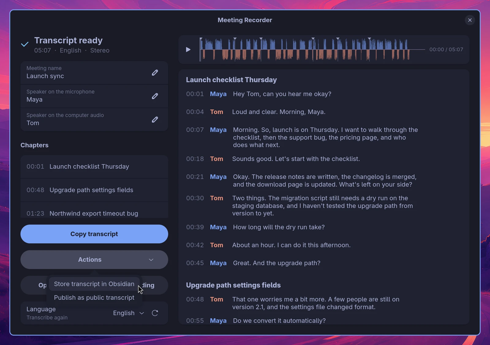

# Actions

Actions are your own scripts, one click away on the done page of every meeting. File the transcript in your notes, publish it, mail it to the people who were there, open a ticket: anything you can write as a command.



Until you add one, the done page shows **Add actions…**, which brings you here.

## Adding an action

Actions live in `~/.config/omarchy-meeting-recorder/config.toml`, the same file where you can pick the speech model. Each one has a name for the menu and a command:

```toml
[[action]]
name = "Store transcript in Obsidian"
command = "~/bin/store-in-obsidian"

[[action]]
name = "Publish as public transcript"
command = "~/bin/publish-transcript"
```

The menu reads this file every time it opens, so a new action shows up without restarting the app.

## What your command gets

The command runs through `sh -c` in the meeting folder, so `~`, pipes and `VAR=value` in front all work. The folder is `$1`, and the meeting is described in these variables:

| Variable | What it holds |
|---|---|
| `MEETING_DIR` | The meeting folder |
| `MEETING_TRANSCRIPT` | `transcript.md` in it |
| `MEETING_MANIFEST` | The `.meeting-recorder` file: JSON with the title, the speakers and the chapters |
| `MEETING_TITLE` | The name of the meeting |
| `MEETING_DATE` | When it started, like `2026-09-25 14:30` |
| `MEETING_STARTED_AT` | The same as a Unix timestamp |
| `MEETING_DURATION` | Its length in seconds |
| `MEETING_LANGUAGE` | The transcript language, a code like `en` |
| `MEETING_SPEAKERS` | The speakers' names, one per line |
| `MEETING_AUDIO` | The audio file, when there is one |

`transcript.md` has a heading with the date and duration, a `## Chapters` list when there are chapters, and then `## Transcript` with one paragraph per turn: `**[01:23] Maya:** What she said.`

## What the app shows

While the command runs, the app says so. When it is done, it shows the last line the command printed; when it fails (a non-zero exit), the last line of its error output. A link on that line, to a web page or an `obsidian://` note, goes behind an **Open** button, so `Saved obsidian://open?vault=...` shows as just "Saved" with Open next to it.

An action can also change the meeting itself: fix names, add notes, rewrite the chapters. When it edited `transcript.md` or the `.meeting-recorder` file, the done page reads them again as soon as the action is done, keeping the player and your place in the transcript. Keep the two in step: a speaker renamed in the transcript is renamed in the manifest's `speakers` too.

Your default agent can do the thinking inside an action: `omarchy-meeting-recorder ask "<prompt>" < "$MEETING_TRANSCRIPT"` runs a prompt over the transcript and prints the answer. Both examples below use it.

## Trying an action out

```bash
omarchy-meeting-recorder action                                  # lists your actions
omarchy-meeting-recorder action "Store transcript in Obsidian" ~/Documents/Meetings/202609251430\ Weekly
```

That runs it exactly as the menu does and prints what the app would show.

## Example: Store transcript in Obsidian

Writes the meeting as a note in your Obsidian vault: date, duration and people as properties, the chapters, and the transcript. Running it again updates the same note. With `SUMMARY=1` your default agent puts a short summary and the action items on top. The last line is an `obsidian://` link, so **Open** takes you straight to the note.

```toml
[[action]]
name = "Store transcript in Obsidian"
command = "OBSIDIAN_VAULT=~/Documents/Notes SUMMARY=1 ~/bin/store-in-obsidian"
```

[examples/actions/store-in-obsidian](../examples/actions/store-in-obsidian):

```python
#!/usr/bin/env python3
"""Copies a meeting into an Obsidian vault as a note.

An action for Meeting Recorder, in ~/.config/omarchy-meeting-recorder/config.toml:

    [[action]]
    name = "Store transcript in Obsidian"
    command = "OBSIDIAN_VAULT=~/Documents/Notes /path/to/store-in-obsidian"

The note goes to <vault>/Meetings/<date> <title>.md, with the date, duration
and people as properties, the chapters, and the transcript. Running it again
updates the same note. With SUMMARY=1 your default agent adds a short summary
and the action items first; that takes a little while.
"""
import json
import os
import re
import subprocess
import sys
import urllib.parse
from pathlib import Path

vault = Path(os.path.expanduser(os.environ.get("OBSIDIAN_VAULT", "~/Documents/Notes")))
folder = os.environ.get("OBSIDIAN_FOLDER", "Meetings")
title = os.environ["MEETING_TITLE"]
date = os.environ["MEETING_DATE"]  # 2026-09-25 14:30
seconds = int(os.environ.get("MEETING_DURATION", "0"))
duration = f"{round(seconds / 60)} minutes" if seconds >= 90 else f"{seconds} seconds"
transcript = Path(os.environ["MEETING_TRANSCRIPT"]).read_text()
manifest = json.loads(Path(os.environ["MEETING_MANIFEST"]).read_text()) if os.environ.get("MEETING_MANIFEST") else {}

# The people who were given a name; "You", "Remote 2" and "Speaker 1" are not people yet.
unnamed = re.compile(r"^(You|Remote|Room|Speaker)( \d+)?$")
people = [p for p in os.environ.get("MEETING_SPEAKERS", "").splitlines() if p and not unnamed.match(p)]
links = [f"[[{p}]]" for p in people]

# Only the lines of the transcript, not its own heading.
body = transcript.split("## Transcript", 1)[-1].strip()


def clock(ms):
    s = ms // 1000
    return f"{s // 3600}:{s // 60 % 60:02}:{s % 60:02}" if s >= 3600 else f"{s // 60:02}:{s % 60:02}"


chapters = "\n".join(f"- [{clock(c['start_ms'])}] {c['title']}" for c in manifest.get("chapters", []))

summary = ""
if os.environ.get("SUMMARY") == "1":
    prompt = ("Summarise this meeting in a few sentences, then list the decisions and the action items "
              "(who does what) as bullets. Write in the language of the meeting. Markdown, no heading.")
    answer = subprocess.run(["omarchy-meeting-recorder", "ask", prompt], input=transcript,
                            capture_output=True, text=True)
    summary = answer.stdout.strip() if answer.returncode == 0 else ""

lines = ["---", f"date: {date[:10]}", "type: meeting", "source: meeting-recorder"]
if links:
    lines += ["people:"] + [f'  - "{l}"' for l in links]
lines += ["tags:", "  - meeting", "---", "", f"# {title}", "",
          f"**Date:** {date}", f"**Duration:** {duration}"]
if links:
    lines.append(f"**People:** {', '.join(links)}")
lines.append(f"**Recording:** [{Path(os.environ['MEETING_DIR']).name}]({Path(os.environ['MEETING_DIR']).as_uri()})")
if summary:
    lines += ["", "## Summary", "", summary]
if chapters:
    lines += ["", "## Chapters", "", chapters]
lines += ["", "## Transcript", "", body, ""]

name = re.sub(r'[\\/:*?"<>|]', "-", f"{date[:10]} {title}")
note = vault / folder / f"{name}.md"
note.parent.mkdir(parents=True, exist_ok=True)
note.write_text("\n".join(lines))

link = "obsidian://open?" + urllib.parse.urlencode({"vault": vault.name, "file": f"{folder}/{name}"},
                                                    quote_via=urllib.parse.quote)
print(f"Saved {link}")
```

## Example: Publish as public transcript

Your default agent writes a summary, the decisions and the action items; the transcript follows as it is, so the agent cannot change what was said. The page goes up as a secret GitHub gist and **Open** shows it. Secret means unlisted: it is not in your public gists and cannot be found, but anyone with the link can read it. Only publish meetings you would share anyway. It needs the GitHub CLI, logged in with `gh auth login`.

```toml
[[action]]
name = "Publish as public transcript"
command = "~/bin/publish-transcript"
```

[examples/actions/publish-transcript](../examples/actions/publish-transcript):

```bash
#!/usr/bin/env bash
# Publishes a meeting as a secret GitHub gist: your default agent writes the
# summary, the decisions and the action items, and the transcript follows as
# it is. Secret means unlisted: anyone with the link can read it.
#
# An action for Meeting Recorder, in ~/.config/omarchy-meeting-recorder/config.toml:
#
#   [[action]]
#   name = "Publish as public transcript"
#   command = "/path/to/publish-transcript"
#
# Needs the GitHub CLI, logged in (gh auth login), and a default agent in Omarchy.
set -euo pipefail
: "${MEETING_TRANSCRIPT:?run this as a Meeting Recorder action}"

prompt='Write a short page about this meeting for people who were not there: a summary of a few sentences, then the decisions and the action items (who does what) as bullets. Use the language of the meeting. Markdown with "## Summary", "## Decisions" and "## Action items" as headings, nothing else.'
summary=$(omarchy-meeting-recorder ask "$prompt" < "$MEETING_TRANSCRIPT")

tmp=$(mktemp -d)
trap 'rm -rf "$tmp"' EXIT
page="$tmp/$(printf '%s' "$MEETING_TITLE" | tr -c 'A-Za-z0-9 _-' '-' | tr ' ' '-').md"
{
  printf '# %s\n\n_%s_\n\n' "$MEETING_TITLE" "$MEETING_DATE"
  printf '%s\n\n' "$summary"
  printf '## Transcript\n\n'
  sed -n '/^## Transcript/,$p' "$MEETING_TRANSCRIPT" | tail -n +2
} > "$page"

url=$(gh gist create --desc "$MEETING_TITLE ($MEETING_DATE)" "$page")
echo "Published as a secret gist $url"
```

## For your agent

Point your coding agent at this page and ask it for an action, for instance: *"Write a Meeting Recorder action that mails the summary and the action items to everyone in the meeting."* Everything it needs:

- An action is an entry in `~/.config/omarchy-meeting-recorder/config.toml`: a `[[action]]` table with `name` (the menu label) and `command` (run with `sh -c`). Add to the file, never replace what is there.
- The command runs in the meeting folder, gets it as `$1`, and gets the `MEETING_*` variables in the table above. Read the transcript from `$MEETING_TRANSCRIPT`; the speakers and chapters are in the JSON at `$MEETING_MANIFEST`. stdin is empty.
- Print one short line when done: it is shown to the user. Put a link in that line and it goes behind an Open button, out of the text: `Saved obsidian://...`, `Published https://...`. Exit non-zero on failure and write the reason to stderr; its last line is shown.
- An action may edit `$MEETING_TRANSCRIPT` and `$MEETING_MANIFEST`; the app shows the result right away. Keep the speaker names in both the same, and keep the `**[mm:ss] Name:** text` line format.
- For text work, use the user's own agent: `omarchy-meeting-recorder ask "<prompt>" < "$MEETING_TRANSCRIPT"` prints the answer. It runs without tools. Keep what was said verbatim; let the agent only add summaries around it.
- A meeting is private. Never send it anywhere the user did not ask for, and say so in the action's name when it leaves the machine.
- Test it with `omarchy-meeting-recorder action "<name>" <meeting folder>` before telling the user it works.
